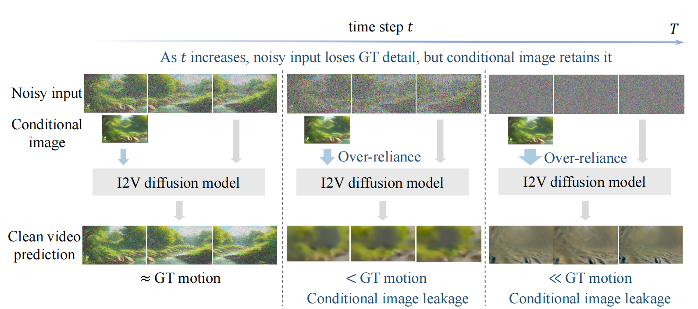

## ___***Identifying and Solving Conditional Image Leakage in Image-to-Video Diffusion Model***___
<!-- {: width="50%"} -->
<!--  -->
<div align="center">

 <a href='https://arxiv.org/abs/2406.15735'></a> &nbsp;
 <a href='https://cond-image-leak.github.io/'></a> &nbsp;
 <a href=''></a> &nbsp;

_**[Min Zhao](https://gracezhao1997.github.io/), [Hongzhou Zhu](https://zhuhz22.github.io/), [Chendong Xiang](https://xiang-cd.github.io/), [Kaiwen Zheng](https://scholar.google.com/citations?user=0d80xSIAAAAJ&hl=en), [Chongxuan Li](https://zhenxuan00.github.io/), [Jun Zhu](https://ml.cs.tsinghua.edu.cn/~jun/software.shtml)**_


</div>
 
## 🔆 Overview

Diffusion models have obtained substantial progress in image-to-video (I2V) generation. However, such models are not fully understood. In this paper, we report a significant but previously overlooked issue in I2V diffusion models (I2V-DMs), namely, conditional image leakage. I2V-DMs tend to over-rely on the conditional image at large time steps, neglecting the crucial task of predicting the clean video from noisy inputs, which results in videos lacking dynamic and vivid motion. We further address this challenge from both inference and training aspects by presenting plug-and-play strategies accordingly. These strategies are validated on various I2V-DMs including [DynamiCrafter](https://doubiiu.github.io/projects/DynamiCrafter),
[SVD](https://github.com/Stability-AI/generative-models) and [VideoCrafter1](https://github.com/AILab-CVC/VideoCrafter).



## ✅ To do list:
- [x] __[2024.06.25]__: Release code, models and project page.
- [ ] Release the models without watermarks and in other resolutions.
- [ ] Applying our strategy on [Vidu](https://arxiv.org/abs/2405.04233), a transformer-based text-to-video diffusion model.


## ⚙️ Setup Environment
Our plug-and-play strategies can be applied to various I2V-DMs, allowing the direct use of their original environments.
For example, to set up DynamiCrafter:
```
cd examples/DynamiCrafter
conda create -n dynamicrafter python=3.8.5
conda activate dynamicrafter
pip install -r requirements.txt
```
To set up VideoCrafter1:
```
cd examples/VideoCrafter
conda create -n videocrafter python=3.8.5
conda activate videocrafter
pip install -r requirements.txt
```
To set up SVD:
```
cd examples/SVD
conda create -n svd python=3.9.18
conda activate svd
pip install -r requirements.txt
```

##  ☀️ Dataset
Download the WebVid dataset from [here](https://github.com/m-bain/webvid), where we use Webvid-2M subset. Put ```.csv``` file in  ```examples/dataset/results_2M_train.csv``` and video data in ```examples/dataset/```. We use the raw data without any filters.
## 🧊 Inference Strategy

We clone the repo of  [DynamiCrafter](https://doubiiu.github.io/projects/DynamiCrafter) and [VideoCrafter1](https://github.com/AILab-CVC/VideoCrafter) and implement  [SVD](https://github.com/Stability-AI/generative-models) by ourselves. We apply our plug and plug-and-play strategies on them.

### 🎒 Initial Noise Distribution

| Model                     | Resolution   | Initial Noise                                                                           |
|:--------------------------|:-------------|:----------------------------------------------------------------------------------------|
| DynamiCrafter     | 256x256      | [Initial Noise](https://huggingface.co/zhuhz22/DynamiCrafter-Analytic-Init/tree/main) |
| DynamiCrafter     | 320x512      | [Initial Noise](https://huggingface.co/zhuhz22/DynamiCrafter-Analytic-Init/tree/main) |
| DynamiCrafter     | 576x1024     | [Initial Noise](https://huggingface.co/zhuhz22/DynamiCrafter-Analytic-Init/tree/main) |
| VideoCrafter      | 256x256      | [Initial Noise](https://huggingface.co/zhuhz22/VideoCrafter-Analytic-Init/tree/main)  |
| VideoCrafter      | 320x512      | [Initial Noise](https://huggingface.co/zhuhz22/VideoCrafter-Analytic-Init/tree/main)  |
| VideoCrafter      | 576x1024     | [Initial Noise](https://huggingface.co/zhuhz22/VideoCrafter-Analytic-Init/tree/main)  |
| SVD                       | 320 x 512   | [Initial Noise](https://huggingface.co/zhuhz22/SVD-Analytic-init/tree/main)      |
| SVD                       | 576 x 1024   | [Initial Noise](https://huggingface.co/zhuhz22/SVD-Analytic-init/tree/main)      |

### 😄 Example Results
<table class="center">
    <tr style="font-weight: bolder;text-align:center;">
        <td>Model</td>
        <td>Conditional Image</td>
        <td>Standard inference</td>
        <td>+ Our inference strategy</td>
    </tr>
  <tr>
  <td>
    DynamiCrafter320x512 
  </td>
  <td>
    
  </td>
  <td>
    
  </td>
  <td>
    
  </td>
  </tr>


   <tr>
  <td>
    VideoCrafter320x512 
  </td>
  <td>
    
  </td>
  <td>
    
  </td>
  <td>
    
  </td>
  </tr>
   <tr>
  <td>
    SVD 576x1024
  </td>
  <td>
    
  </td>
  <td>
    
  </td>
  <td>
    
  </td>
  </tr>
</table >

### DynamiCrafter
1. Download the original DynamiCrafter checkpoints from the [repository](https://github.com/Doubiiu/DynamiCrafter) and put it in ```examples/DynamiCrafter/ckpt/original``` ,or  download our DynamiCrafter-CIL from [here](https://huggingface.co/GraceZhao/DynamiCrafter-CIL-512) and put it in ```examples/DynamiCrafter/ckpt/finetuned```. Download the initial noise in the above table and put it in ```examples/DynamiCrafter/ckpt/```. 
2. Run the following commands:
```
cd examples/DynamiCrafter

# for original DynamiCrafter with 320x512 resolution
sh inference_512.sh

# for our DynamiCrafter-CIL with 320x512 resolution
sh inference_CIL_512.sh
```

The relevant parameters in ```inference.sh``` for our strategy are explained as follows:
* ```M```: the start timestep M. 
* ```whether_analytic_init```:  indicates whether to use Analytic-Init; 0 means it is not applied, while 1 means it is applied
* ```analytic_init_path```: the path for initializing the mean and variance of the noise if Analytic-Init is applied 

Note that ```M=1000, whether_analytic_init=0``` is the baseline.


The effect of start time ```M ``` is as follows:
<table class="center">
    <tr style="font-weight: bolder;text-align:center;">
        <td>Conditional Image</td>
        <td>M=1.00T</td>
        <td>M=0.94T</td>
        <td>M=0.90T</td>
        <td>M=0.86T</td>
        <td>M=0.82T</td>
    </tr>
    <tr>
    <td>
      
    </td>
        <td>
      
    </td>
        <td>
      
    </td>
        <td>
      
    </td>
        <td>
      
    </td>
        <td>
      
    </td>
    </tr>
</table >
An appropriate M can
enhance performance by increasing motion without compromising other performance. A too-small
M delivers poor visual quality due to the training-inference gap.

### SVD
1. Download the [pretrained SVD model](https://huggingface.co/stabilityai/stable-video-diffusion-img2vid) and put it in `examples/SVD/ckpt/pretrained/stable-video-diffusion-img2vid` . Download our SVD-CIL from [here](https://huggingface.co/GraceZhao/SVD-CIL-512) and put it in ```examples/SVD/ckpt/finetuned```. Download the initial noise in the above table and put them in ```examples/SVD/ckpt/```. 
2. Run the following commands:
```
cd examples/SVD

# for original SVD
sh inference.sh

# for SVD-CIL with 320x512 resolution
sh inference_CIL_512.sh
 
```
The relevant parameters for inference are set in `examples/SVD/config/inference.yaml`,which are explained as follows:
* ```sigma_max```: the start time M.  
* ```analytic_init_path```: the path for initializing the mean and variance of the noise if Analytic-Init is applied 

### VideoCrafter1
1. Download the original VideoCrafter checkpoints from the [repository](https://github.com/AILab-CVC/VideoCrafter) and put it in ```examples/VideoCrafter/ckpt/original```,or  download our VideoCrafter-CIL from [here](https://huggingface.co/GraceZhao/VideoCrafter1-naive-finetune) and put it in ```examples/VideoCrafter/ckpt/finetuned```.Download the initial noise in the above table and put them in ```examples/VideoCrafter/ckpt```. 
2. Run the following commands:

```
cd examples/VideoCrafter

# for original VideoCrafter with 320x512 resolution
sh inference_512.sh

# for VideoCrafter-CIL with 320x512 resolution
sh inference_CIL_512.sh
```

The relevant parameters in ```inference.sh``` for our strategy are explained as follows:
* ```M```: the start time M 
* ```analytic_init_path```: the path for initializing the mean and variance of the noise if Analytic-Init is applied 

## 🔥 Training Strategy
Similar to the inference strategy, we finetune the baselines based on the repository  [DynamiCrafter](https://doubiiu.github.io/projects/DynamiCrafter), [VideoCrafter1](https://github.com/AILab-CVC/VideoCrafter) and [SVD](https://github.com/Stability-AI/generative-models). 

### 😄 Example Results

<table class="center">
    <tr style="font-weight: bolder;text-align:center;">
        <td>Model</td>
        <td>Conditional Image</td>
        <td>Finetuned-Baseline</td>
        <td>+ Our training strategy</td>
    </tr>
  <tr>
  <td>
    DynamiCrafter
  </td>
  <td>
    
  </td>
  <td>
    
  </td>
  <td>
    
  </td>
  </tr>


   <tr>
  <td>
    VideoCrafter
  </td>
  <td>
    
  </td>
  <td>
    
  </td>
  <td>
    
  </td>
  </tr>
   <tr>
  <td>
    SVD
  </td>
  <td>
    
  </td>
  <td>
    
  </td>
  <td>
    
  </td>
  </tr>
</table >

### DynamiCrafter
1. Download the DynamiCrafter checkpoints from the [repository](https://github.com/Doubiiu/DynamiCrafter) and put them in ```examples/DynamiCrafter/ckpt/original```.
2. Run the following commands:
```
cd examples/DynamiCrafter
sh train.sh
```
The relevant parameters in ```train.sh``` for our strategy are explained as follows:
* ```beta_m```: the maximum noise level.  
* ```a```:  the exponent of center of the distribution: $/mu(t)=2t^a-1$, where $a > 0$. 

The effect of ```beta_m```is as follows:
<table class="center">
    <tr style="font-weight: bolder;text-align:center;">
        <td>Conditional Image</td>
        <td>beta_m=25</td>
        <td>beta_m=100</td>
        <td>beta_m=700</td>
    </tr>
    <tr>
    <td>
      
    </td>
        <td>
      
    </td>
        <td>
      
    </td>
        <td>
      
    </td>
    </tr>
</table >
Higher beta_m correspond to more dynamic motion and lower temporal consistency and image alignment. 

The effect of ```a``` is as follows:
<table class="center">
    <tr style="font-weight: bolder;text-align:center;">
        <td>Conditional Image</td>
        <td>a = 5.0</td>
        <td>a = 1.0</td>
        <td>a = 0.1</td>
    </tr>
    <tr>
    <td>
      
    </td>
        <td>
      
    </td>
        <td>
      
    </td>
        <td>
      
    </td>
    </tr>
</table >

Lower a correspond to more dynamic motion and lower temporal consistency and image alignment.

### SVD
1. Download the SVD checkpoints from the [repository](https://github.com/Stability-AI/generative-models) and put them in ```examples/SVD/ckpt/pretrained/stable-video-diffusion-img2vid```;
2. Run the following commands:
```
cd examples/SVD
sh train.sh
```
The relevant parameters in `examples/SVD/config/train.yaml`for our strategy are explained as follows: 

* ```beta_m```: the maximum noise level.  Higher beta_m correspond to more dynamic motion and lower temporal consistency and image alignment. 
* ```a```:  the exponent of center of the distribution: $/mu(t)=2t^a-1$, where $a > 0$. Lower $a$ correspond to more dynamic motion and lower temporal consistency and image alignment.

Note that original SVD first add noise on conditional image and then feed it into VAE. Here we first feed the conditional image into VAE and then add noise on the conditional latents.

### VideoCrafter1
1. Download the VideoCrafter checkpoints from the [repository](https://github.com/AILab-CVC/VideoCrafter) and put them in ```examples/VideoCrafter/original/ckpt/```.
2. Run the following commands:
```
cd examples/VideoCrafter
sh train.sh
```
The relevant parameters in ```train.sh``` for our strategy are explained as follows:

* ```beta_m```: the maximum noise level.  Higher beta_m correspond to more dynamic motion and lower temporal consistency and image alignment. 
* ```a```:  the exponent of center of the distribution: $/mu(t)=2t^a-1$, where $a > 0$. Lower $a$ correspond to more dynamic motion and lower temporal consistency and image alignment.

### 🎒 Checkpoints
Naive fine-tuning and ours were trained under the same settings for fair comparison. In the future, we will release the model without watermark.

| Model                   | Naive Fine-Tuning                                                                         | ours on Webvid                                                                    |
|:------------------------|:---------------------------------------------------------------------------------------|:----------------------------------------------------------------------------------|
| DynamiCrafter           | [320x512](https://huggingface.co/GraceZhao/DynamiCrafter-naive-finetune)      | [320x512](https://huggingface.co/GraceZhao/DynamiCrafter-CIL-512) |
| SVD                     | [320x512](https://huggingface.co/GraceZhao/SVD-naive-finetune) | [320x512](https://huggingface.co/GraceZhao/SVD-CIL-512) |
| VideoCrafter1           | [320x512](https://huggingface.co/GraceZhao/VideoCrafter1-naive-finetune)     | [320x512](https://huggingface.co/GraceZhao/VideoCrafter1-CIL-512) |


## 😄 Citation
If you find this repository helpful, please cite as:
```bib
@article{zhao2024Identifying,
  title={Identifying and Solving Conditional Image Leakage
in Image-to-Video Diffusion Model},
  author={Min Zhao, Hongzhou Zhu, Chendong Xiang, Kaiwen Zheng, Chongxuan Li and Jun Zhu},
  journal={arXiv preprint arXiv:2406.15735},
  year={2024}
}
```

## ❤️ Acknowledgements
This implementation is based on the following work:
* [DynamiCrafter: Animating Open-domain Images with Video Diffusion Priors](https://doubiiu.github.io/projects/DynamiCrafter)
* [Stable Video Diffusion: Scaling Latent Video Diffusion Models to Large Datasets](https://github.com/Stability-AI/generative-models)
* [VideoCrafter1: Open Diffusion Models for High-Quality Video Generation](https://github.com/AILab-CVC/VideoCrafter)/
Thanks to the authors for sharing their code and models.